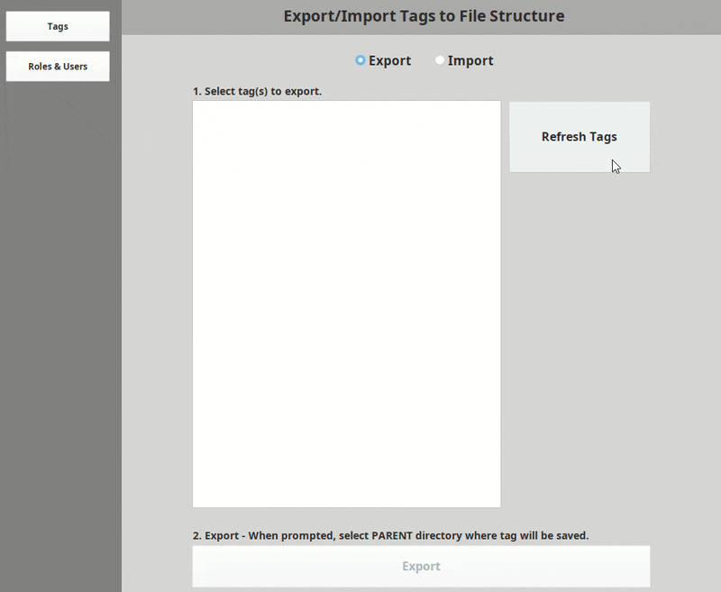
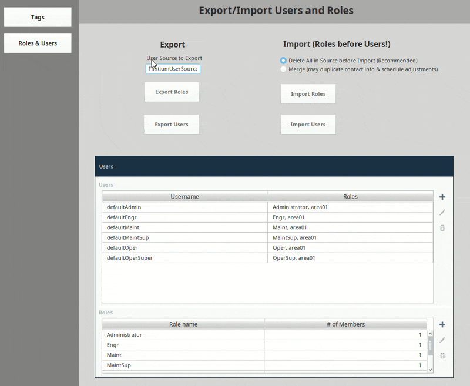

# Ignition Version Control Tools
An Ignition project with tools to export and import gateway resources in a version control friendly format. 

## Required Software  
* Ignition v8.0.x

## Setup  
* Install Ignition v8+ and Git (or Git for Windows)
* On the Ignition Gateway computer, open /Ignition/data/projects folder, and run  
```git clone https://github.com/jlbcontrols/ign-gw-vcs-export-import.git```  
* Open the project in Ignition, and navigate to one of the tool windows described below.

## Tag Export/Import Tool   
This tool is an alternative to the tag export/import functions built into the Ignition Designer. It aims to solve some version control problems with the built-in tool, namely: tags are saved as one large json file, the order of json keys is not consistent, and importing will not delete tags (only adds or reconfigures, even if "overwrite" is selected). That makes version control difficult.

The Tag Export/Import saves tags as a file structure. Each tag gets its own folder, named after the tag. The folder contains a configuration file, and folders for child tags. You can see an example of exported tag files [here](https://github.com/jlbcontrols/Flintium/tree/master/flintium-tags/FlintiumTypes).

  

## Roles & Users Export/Import Tool
Use this tool to save roles and users as json files.  


